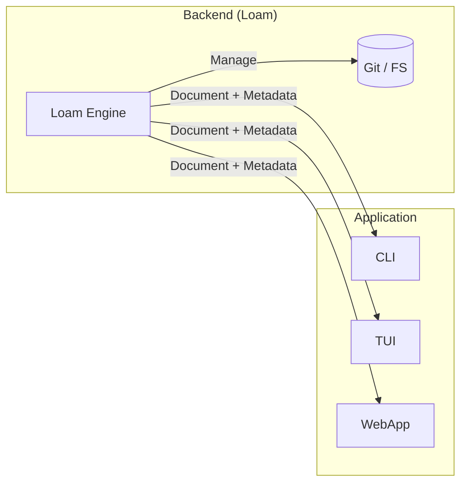

# Visão do Produto

**Loam** é um driver de banco de dados para conteúdo e metadados. O objetivo principal é fornecer uma camada de persistência transacional agnóstica, tratando arquivos como documentos estruturados em formatos familiares como Markdown, JSON, YAML e CSV.

## Filosofia: O Bibliotecário (Librarian)

Uma distinção crucial no Loam é a separação entre **Armazenamento** e **Interpretação**.

- **Loam é o Bibliotecário:** Sua função é organizar, recuperar e proteger os documentos. Ele gerencia onde os arquivos estão, seus metadados e a integridade do histórico.
- **Seu App é o Leitor:** Sua aplicação decide como apresentar o conteúdo para o usuário final, seja renderizando Markdown para HTML ou transformando JSON em uma interface interativa.

## Comparativo de Mercado

| Característica | SQLite | Loam | Texto Puro (os.IO) |
| :--- | :--- | :--- | :--- |
| **Modelo Mental** | Tabelas Relacionais | Documentos & Metadados | Bytes / Strings |
| **Legibilidade** | Binário (Opaco) | Humana (Texto Claro) | Humana |
| **Histórico** | Logs Binários | Git (Commit-based) | Nenhum |
| **Uso Ideal** | Dados Relacionais | Conteúdo, Configs, PKM | Scripts Simples |

## Pilares & Diferenciais

### 1. Local-First & Soberania

Seus dados permanecem como arquivos simples no disco. O Loam garante que a aplicação funcione 100% offline e que o usuário mantenha o controle total sobre seus arquivos, sem lock-in.

### 2. Git como Infraestrutura

Todo `Save` gera um registro no Git. Isso fornece um rastro de auditoria automático, suporte a rollbacks e garante que operações em lote sejam atômicas (ou salva tudo, ou nada).

### 3. Automação e Integridade

O Loam implementa file-locking e transações para evitar que scripts concorrentes corrompam o repositório. Ele combina a flexibilidade de dados *schemaless* com a segurança de uma API tipada em Go.

### 4. Engine Reativa

Monitore mudanças no disco e reaja em tempo real. O Loam normaliza eventos do SO, filtra ruídos e garante que a aplicação responda instantaneamente a mudanças externas.

### 5. Fidelidade de Dados (Smart Serializers)

Preserve estruturas complexas mesmo em formatos planos. O Smart CSV, por exemplo, gerencia aninhamento de metadados sem exigir marshaling manual do desenvolvedor.

## Aplicabilidade

- **Toolmakers:** Desenvolvimento de bots, CLIs ou automações leves.
- **Engenharia de Dados:** Pipelines de ETL locais e processamento de arquivos estruturados.
- **DevOps:** Gerenciamento de configurações via GitOps e dotfiles.
- **PKM (Personal Knowledge Management):** Camada de storage para notas e bases de conhecimento.

## Design Principles

- **Rastreabilidade Semântica:** Toda mudança deve ter uma razão. No Loam, isso se traduz em commits semânticos (Conventional Commits).
- **Schema-on-Read:** O armazenamento é flexível e dinâmico, mas a aplicação pode definir contratos rígidos via `TypedRepository[T]` para garantir segurança em tempo de execução.
