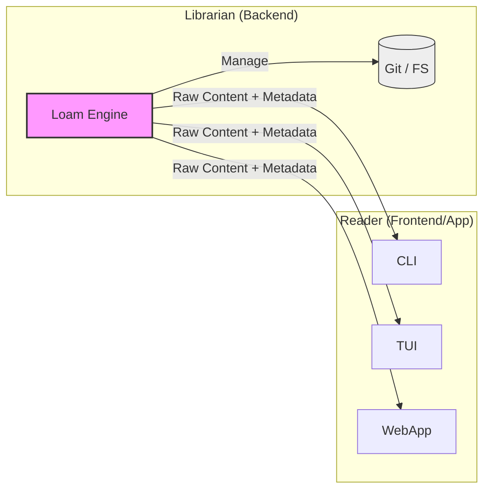

# Visão do Produto

**Loam** é um "driver de banco de dados" para conteúdo e metadados.
O objetivo principal é fornecer uma **camada de persistência transacional** agnóstica. A implementação de referência (FS Adapter) suporta nativamente **Markdown, JSON, YAML e CSV**, tratando arquivos como documentos estruturados.

## Identidade: O Bibliotecário (Librarian)

Uma distinção crucial na filosofia do Loam é a separação entre **Armazenamento** e **Interpretação**.

- **Loam é o Bibliotecário:** Sua função é *organizar, guardar, recuperar e proteger* os documentos. Ele sabe onde o livro está, quem escreveu, e o que está escrito na ficha catalográfica (metadados). Ele **não lê** o livro para você.
- **Seu App é o Leitor:** Sua aplicação (CLI, TUI, Web App) é quem decide como *apresentar* o conteúdo. Se o Markdown deve virar HTML, se o JSON deve virar um gráfico, isso é responsabilidade do "Leitor".

O Loam fornece o *acesso* e a *integridade*. O App fornece a *experiência*.

## Comparativo de Mercado

Entender onde o Loam se encaixa ajuda a escolher a ferramenta certa:

| Característica | SQLite | Loam | Arquivo Texto Puro (Raw IO) | Excel / CSV |
| :--- | :--- | :--- | :--- | :--- |
| **Modelo Mental** | Tabelas Relacionais | Documentos & Metadados | Bytes / Strings | Planilhas / Linhas |
| **Legibilidade** | Binário (Opaco) | Humana (Clear text) | Humana | Humana |
| **Transações** | ACID Completo | Batch Transactions (ACID-ish) | Nenhuma (Race Conditions) | Nenhuma |
| **Histórico** | Logs Binários / Nenhum | Git Backed (Infinito) | Nenhum | Nenhum |
| **Uso Ideal** | App Data, Relacionamentos | Conteúdo, Configuração, PKM | Scripts Descartáveis | Análise de Dados |

O Loam é o "SQLite para Conteúdo". Ele preenche a lacuna entre a simplicidade de um arquivo de texto e a segurança de um banco de dados.

## Pilares & Diferenciais

Por que usar o Loam em vez de `os.WriteFile` ou um Banco de Dados tradicional?

### 1. Conformidade Local-First
>
> "Seus dados, suas regras."

- **Zero Lock-in**: Seus dados são apenas arquivos (`.md`, `.json`, `.csv`) no seu disco. Você não precisa do Loam para lê-los.
- **Soberania**: A nuvem é um espelho, não o dono. **O Loam** garante que sua aplicação funcione 100% offline.
- **Legibilidade Humana**: Ao contrário de um arquivo binário `.db`, qualquer humano (ou IA) pode abrir e entender o estado do sistema.

### 2. GitOps Nativo
>
> "Infraestrutura como Código -> Dados como Código."

- **Histórico & Auditoria**: Quem mudou o quê? O Git responde. O Loam transforma qualquer diretório em um sistema versionado.
- **Rollback Instantâneo**: Use `git revert` ou APIs de histórico para desfazer erros catastróficos em milissegundos. **O Loam** facilita esse controle.
- **Transações em Lote**: O Loam garante atomicidade nos commits. Ou salva tudo, ou não salva nada, prevenindo estados corrompidos.

### 3. Automação Segura (ACID-ish)
>
> "Scripts não devem quebrar o banco."

- **File Locking**: Previne que dois processos editem o mesmo arquivo simultaneamente.
- **Estrutura Híbrida**: Combina a flexibilidade de documentos schemaless (Frontmatter) com a segurança de leitura tipada em Go (`TypedRepository[T]`).

### 4. Engine Reativa
>
> "O mundo muda, seu app reage."

- **Tempo Real**: Monitore mudanças no disco e reaja instantaneamente (Hot Reload, Live Previews).
- **Inteligência**: O Loam filtra ruídos, evita loops infinitos e normaliza eventos de diferentes sistemas operacionais.
- **Robustez**: Um Broker de Eventos desacoplado garante que sua aplicação nunca trave, mesmo sob carga pesada.

### 5. Data Fidelity (Smart Serializers)
>
> "O formato não define o dado."

- **Smart CSV**: O Loam preserva automaticamente estruturas complexas (JSON aninhado em colunas CSV) sem que você precise gerenciar marshaling manual.
- **Customização**: Estenda o sistema com seus próprios serializers se precisar de suporte a formatos proprietários.

## Objetivos

1. **Centralizar a Persistência:** Abstrair operações de armazenamento e serialização para evitar duplicação de regras em diferentes ferramentas.
2. **Type Safety e Estrutura:** Oferecer uma API tipada (`pkg/typed`) que mapeia documentos para structs Go, garantindo contratos de dados em tempo de compilação.
3. **Garantir Integridade (ACID-ish):** Prevenir condições de corrida quando múltiplos processos tentam editar o mesmo repositório simultaneamente.
4. **Histórico Auditável:** Manter um log de alterações transparente e reversível (implementado via Git no adapter padrão).
5. **Estrutura Universal:** Focar na estrutura "Conteúdo + Metadados", independente do formato de serialização final (Markdown, JSON, SQL).
6. **Portabilidade:** Ser distribuído como uma biblioteca Go e/ou um binário *standalone*.

## Personas (Público-alvo)

1. **Toolmakers:** Desenvolvedores criando bots, CLIs ou automações.
2. **Engenheiros de Dados:** Usuários avançados que desejam pipelines de ETL locais.
3. **DevOps & SREs:** Gerenciamento seguro de configurações (GitOps) e dotfiles.
4. **Entusiastas de "Local-First":** Quem busca soberania sobre seus dados.

## User Stories

- "Como desenvolvedor, quero garantir que minhas automações não corrompam o repositório Git (concorrência interna)."
- "Como usuário, quero desfazer um script mal sucedido usando `git revert` sem perder o estado consistente do cofre."
- "Como usuário Unix, quero processar meus documentos usando pipes (`|`) e ferramentas padrão (`jq`, `sed`) sem fricção."
- "Como ferramenta externa, quero ler o frontmatter de 1000 notas rapidamente."

## Filosofia de Design

### Rastreabilidade Semântica

O Loam trata o histórico de mudanças como um log estruturado, não apenas texto livre.

- **Intenção sobre Implementação:** O usuário informa a *intenção* (Feat, Chore, Fix) e a razão da mudança.
- **Adaptação:** No adapter FS, isso se traduz em **Commits Semânticos** (Conventional Commits). Em um adapter SQL, poderia ser uma tabela de auditoria.
- **Assinatura:** Mudanças geradas via automação devem indicar sua origem (ex: `Powered by Loam`).

### Estrutura Opcional (Schema-on-Read)

O Loam não impõe schemas no armazenamento (banco de dados schemaless), mas permite schemas rigorosos na aplicação.

- **Armazenamento Flexível:** Arquivos podem ter campos extras ou estruturas variadas.
- **Leitura Tipada:** A aplicação define structs (`TypedRepository[T]`) para consumir apenas o que interessa, tratando erros de validação no momento da leitura.
