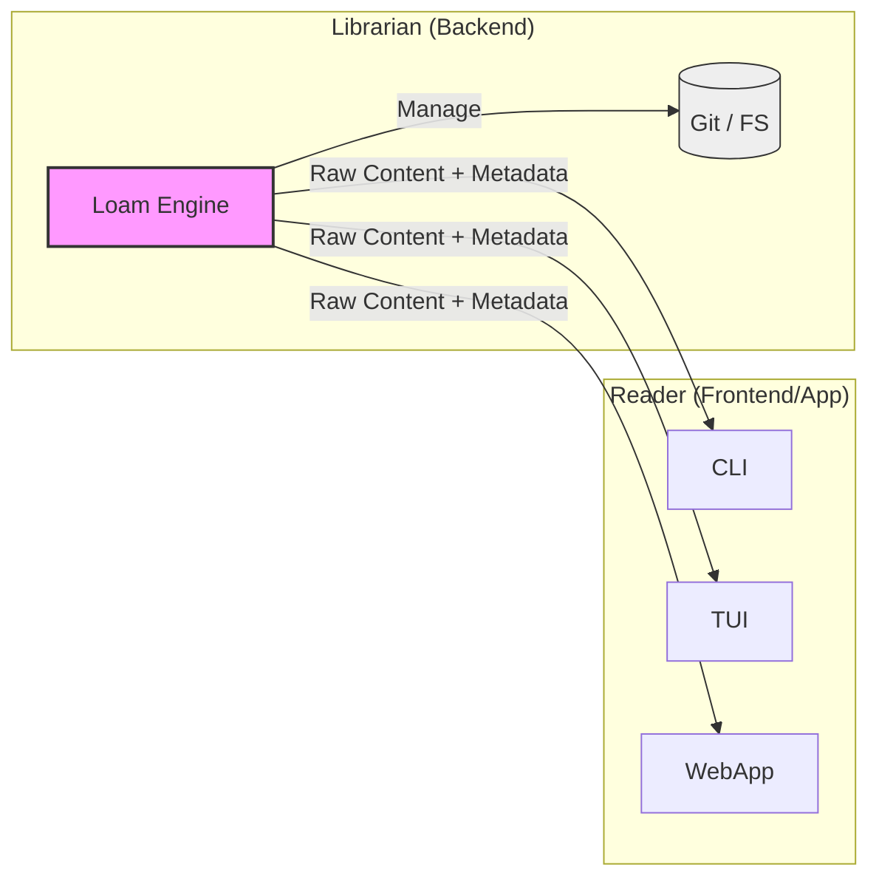

# Visão do Produto

**Loam** é um "driver de banco de dados" para conteúdo e metadados.
O objetivo principal é fornecer uma **camada de persistência transacional** agnóstica. A implementação de referência (FS Adapter) suporta nativamente **Markdown, JSON, YAML e CSV**, tratando arquivos como documentos estruturados.

## Identidade: O Bibliotecário (Librarian)

Uma distinção crucial na filosofia do Loam é a separação entre **Armazenamento** e **Interpretação**.

- **Loam é o Bibliotecário:** Sua função é *organizar, guardar, recuperar e proteger* os documentos. Ele sabe onde o livro está, quem escreveu, e o que está escrito na ficha catalográfica (metadados). Ele **não lê** o livro para você.
- **Seu App é o Leitor:** Sua aplicação (CLI, TUI, Web App) é quem decide como *apresentar* o conteúdo. Se o Markdown deve virar HTML, se o JSON deve virar um gráfico, isso é responsabilidade do "Leitor".

O Loam fornece o *acesso* e a *integridade*. O App fornece a *experiência*.

## Comparativo de Mercado

Entender onde o Loam se encaixa ajuda a escolher a ferramenta certa:

| Característica | SQLite | Loam | Arquivo Texto Puro (Raw IO) | Excel / CSV |
| :--- | :--- | :--- | :--- | :--- |
| **Modelo Mental** | Tabelas Relacionais | Documentos & Metadados | Bytes / Strings | Planilhas / Linhas |
| **Legibilidade** | Binário (Opaco) | Humana (Clear text) | Humana | Humana |
| **Transações** | ACID Completo | Batch Transactions (ACID-ish) | Nenhuma (Race Conditions) | Nenhuma |
| **Histórico** | Logs Binários / Nenhum | Git Backed (Infinito) | Nenhum | Nenhum |
| **Uso Ideal** | App Data, Relacionamentos | Conteúdo, Configuração, PKM | Scripts Descartáveis | Análise de Dados |

O Loam é o "SQLite para Conteúdo". Ele preenche a lacuna entre a simplicidade de um arquivo de texto e a segurança de um banco de dados.

## Por que Loam?

Para desenvolvedores acostumados com bancos de dados tradicionais, lidar com arquivos locais pode ser **desafiador e propenso a erros**. O Loam traz a robustez de um banco de dados para o mundo dos arquivos de texto.

- **SQLite para Documentos:** Assim como o SQLite é o padrão para dados relacionais locais, o Loam **se propõe a ser uma fundação sólida** para conteúdo não-estruturado (Markdown) e estruturado (CSV, JSON). Oferece suporte nativo a **Multi-Documentos** (coleções em um único arquivo) e um padrão **Active Record** para uma **melhor experiência de desenvolvimento (DX)**.
- **Automação Segura:** Seus scripts Python/Bash que editam arquivos podem corromper o repositório se rodarem concorrentemente. O Loam implementa *file locking* e transações para evitar isso.

## Objetivos

1. **Centralizar a Persistência:** Abstrair operações de armazenamento e serialização para evitar duplicação de regras em diferentes ferramentas.
2. **Garantir Integridade (ACID-ish):** Prevenir condições de corrida quando múltiplos processos tentam editar o mesmo repositório simultaneamente.
3. **Histórico Auditável:** Manter um log de alterações transparente e reversível (implementado via Git no adapter padrão).
4. **Estrutura Universal:** Focar na estrutura "Conteúdo + Metadados", independente do formato de serialização final (Markdown, JSON, SQL).
5. **Portabilidade:** Ser distribuído como uma biblioteca Go e/ou um binário *standalone*.

## Personas (Público-alvo)

1. **Toolmakers:** Desenvolvedores criando bots, CLIs ou automações.
2. **Engenheiros de Dados:** Usuários avançados que desejam pipelines de ETL locais.
3. **DevOps & SREs:** Gerenciamento seguro de configurações (GitOps) e dotfiles.
4. **Entusiastas de "Local-First":** Quem busca soberania sobre seus dados.

## User Stories

- "Como desenvolvedor, quero garantir que minhas automações não corrompam o repositório Git (concorrência interna)."
- "Como usuário, quero desfazer um script mal sucedido usando `git revert` sem perder o estado consistente do cofre."
- "Como ferramenta externa, quero ler o frontmatter de 1000 notas rapidamente."

## Filosofia de Design

### Rastreabilidade Semântica

O Loam trata o histórico de mudanças como um log estruturado, não apenas texto livre.

- **Intenção sobre Implementação:** O usuário informa a *intenção* (Feat, Chore, Fix) e a razão da mudança.
- **Adaptação:** No adapter FS, isso se traduz em **Commits Semânticos** (Conventional Commits). Em um adapter SQL, poderia ser uma tabela de auditoria.
- **Assinatura:** Mudanças geradas via automação devem indicar sua origem (ex: `Powered by Loam`).
