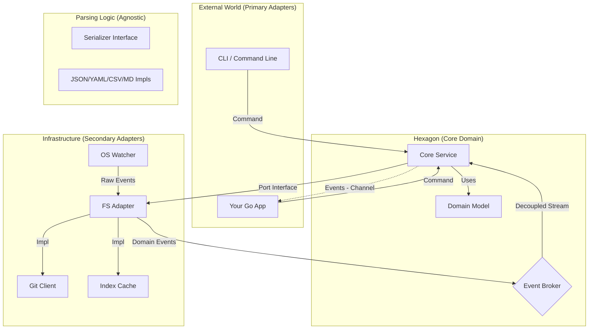
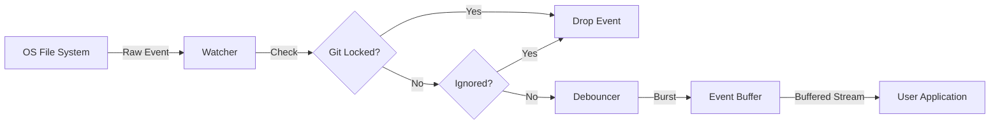
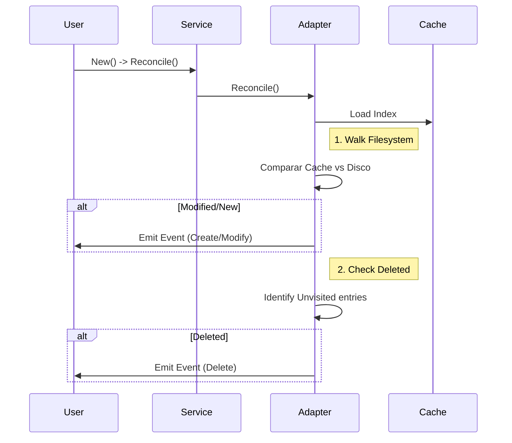
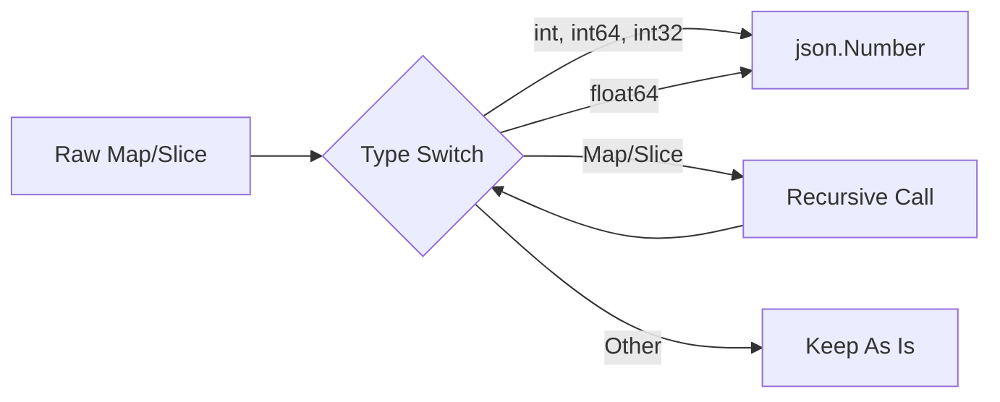
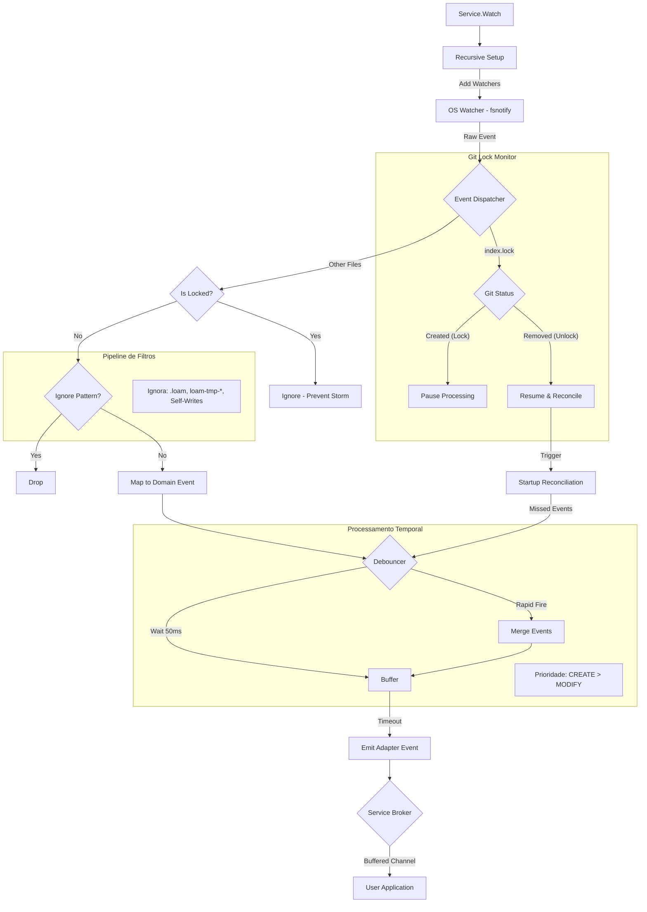

# Arquitetura Técnica

O **Loam** adota uma **Arquitetura Hexagonal (Ports & Adapters)** híbrida com **Event-Driven Architecture**.

1. **Hexagonal (Write Path)**: Garante desacoplamento na persistência (FS, Git, SQL).
2. **Event-Driven (Read Path)**: Garante reatividade, notificando a aplicação sobre mudanças externas.

## Visão Geral



## Fluxos de Execução

### Batch Transaction (Atomicidade)

O fluxo de uma transação em lote garante que arquivos só sejam persistidos e commitados se todas as operações tiverem sucesso.


### Ciclo de Vida do Documento


### Reactive Event Loop

O mecanismo protege a aplicação de "Event Storms" (ex: `git checkout`) e garante que o processamento do usuário nunca bloqueie o watcher (via Buffer).



### Startup Reconciliation (Cold Start)

Garante que mudanças ocorridas enquanto o aplicativo estava fechado (offline) sejam detectadas e emitidas como eventos na inicialização.



## Componentes

A estrutura de diretórios do projeto reflete diretamente a arquitetura hexagonal adotada:

```text
.
├── cmd/                # Pontos de entrada (CLI)
├── internal/
│   └── platform/       # Implementações de Infraestrutura (Hidden)
├── pkg/
│   ├── adapters/       # Adaptadores (FS, Git) - "Fora do Hexágono"
│   ├── core/           # Domínio e Portas - "Dentro do Hexágono"
│   └── typed/          # Camada de Tipagem (Generic Wrapper)
├── loam.go             # Facade pública
└── examples/           # Exemplos de uso
```

### 1. Core Domain (`pkg/core`)

- **Entidades**: `Document` (ID, Content, Metadata).
- **Ports (Interfaces)**: `Repository` (Save, Get, List, Delete) — O "Abstract Librarian".
- **Services**: `Service` (Orquestra validações e chama o Repository).
- **Dependências**: Zero dependências de infraestrutura.

### 2. Adapters (`pkg/adapters`)

Implementações concretas dos Ports definidos no Core.

- **FS Adapter (`pkg/adapters/fs`)**: Implementa `core.Repository`. A "Estante Física".
  - Gerencia a **persistência física** de Documentos.
  - **Serializers Plugáveis**: Utiliza a interface `Serializer` para suportar múltiplos formatos (Markdown, JSON, YAML, CSV) de forma extensível. Novos formatos podem ser registrados via `RegisterSerializer`.
  - Utiliza `pkg/git` para controle de versão.
  - Mantém um **Cache (.loam/index.json)** para listagens rápidas (Otimização).

### 3. Typed Layer (`pkg/typed`)

Camada de conveniência que envolve o `core.Service` para fornecer APIs genéricas (`TypedRepository[T]`).

- **Responsabilidade**: Marshaling/Unmarshaling de structs Go para `core.Metadata` (map[string]any).
- **Benefício**: Garante que o consumidor trabalhe com tipos fortes, enquanto o core permanece dinâmico.

### 4. Internal Platform (`internal/platform`)

O "chão de fábrica" do sistema. Contém a implementação concreta do bootstrap e segurança.

- **Responsabilidade**: Factory method, Configuração de Opções, Sanitização de Paths (`ResolveVaultPath`) e utilitários de Dev (`IsDevRun`).
- **Visibilidade**: Privado para a biblioteca, não importável externamente.

### 5. Public Facade (`github.com/aretw0/loam`)

A fachada pública que simplifica o uso da biblioteca.

- **`loam.go`**: Expõe aliases para as funções do `internal/platform` (`New`, `Init`, `Sync`, `Option`) e `pkg/typed` (`OpenTyped`).
- **Objetivo**: Manter a raiz do projeto limpa e fornecer uma API estável enquanto a implementação evolui internamente.

## Decisões Arquiteturais Chave

### 1. Storage Engine: Filesystem + Git (Driver Padrão)

- **Formato:** Arquivos de texto (`.md`, `.json`, `.yaml`, `.csv`) gerenciados pelo FS Adapter.
- **Smart Retrieval (Fuzzy Lookup):** Ao buscar um documento sem extensão, o adapter escaneia o diretório por extensões suportadas.
- **Transações:** O Git atua como *Write-Ahead Log*.
- **Smart Gitless:** O sistema detecta automaticamente se deve usar Git. Se `.git` não existir, mas `.loam` (system dir) existir, ele opera em modo "Gitless" (apenas FS), permitindo uso flexível em ambientes contêinerizados ou efêmeros.
- **Semântica de Commit:** O adapter `fs` lê `commit_message` do `context.Context` (se Git estiver ativo).

### 2. Smart CSV & Data Fidelity

- **Problema:** O formato CSV é plano, mas aplicações modernas usam dados estruturados (JSON). Perder essa estrutura ao salvar em CSV (Type Erasure) quebra o conceito de "Fidelidade".
- **Solução (Smart CSV):** O serializer CSV do Loam detecta automaticamente campos complexos (`map`, `slice`, `struct`) e os serializa como JSON stringificado dentro da célula CSV. Na leitura, ele faz o processo inverso (Unflattening) de forma transparente.
- **Benefício:** Permite usar CSV para facilitar análise de dados (Excel/Pandas) sem perder a riqueza do modelo de domínio da aplicação.

### 3. Cache de Metadados

- **Problema:** Listar milhares de arquivos lendo do disco é lento.
- **Solução:** Index Persistente (`.loam/index.json`) mantido pelo Adapter FS. O diretório (`.loam`) é configurável via `WithSystemDir`.
- **Invalidação:** Baseada em timestamp (`mtime`).
- **Performance:** Reduz tempo de listagem de segundos para milissegundos (ex: 6s -> 13ms para 1k documentos).
- **Caveat (Coleções):** Arquivos compostos (ex: CSV/JSON array) *não* possuem suas sub-entradas indexadas no cache. Eles são parseados sob demanda no `List`, o que pode impactar a performance se houverem grandes coleções.

### 4. Strict Mode & Fidelidade de Tipos (Polyglot Consistency)

- **Problema:** Backends diferentes possuem comportamentos de serialização distintos. O JSON padrão decodifica números como `float64` (perda de precisão em IDs grandes), enquanto YAML e Markdown podem variar.
- **Solução (Strict Mode):** O Adapter FS permite configurar `WithStrict(true)`. Isso ativa um modo de alta fidelidade que normaliza o parsing de números para `json.Number` em **todos** os adaptadores suportados (JSON, YAML, Markdown, CSV).
- **Interoperabilidade:** Garante que um dado salvo como `int64` em um formato seja lido como tal em outro, crucial para sistemas financeiros ou que usam IDs tipo Snowflake.
- **Trade-offs (Por que é opcional?):**
  1. **Go Idioms:** Retornar `json.Number` quebra asserções de tipo comuns (`val.(float64)`). O padrão `strict: false` mantém o comportamento "surpresa zero" para código Go idiomático.
  2. **Performance:** A normalização recursiva (`recursiveNormalize`) incorre em overhead de CPU e alocação (cópia de mapas).

#### Estratégia de Normalização (Recursive Normalize)

Para garantir consistência poliglota, o Loam aplica uma normalização recursiva pós-parsing quando `Strict Mode` está ativo.



**Caveats:**

1. **Performance:** A recursão tem custo CPU linear ao tamanho do documento. Para documentos gigantescos com deep nesting, isso pode ser perceptível.
2. **Overhead de Alocação:** Recria mapas e slices para garantir a tipagem correta.

### 5. Segurança (Dev Safety)

- **Isolamento**: Em modo de desenvolvimento (`go run`, `go test`), o Loam redireciona automaticamente operações para um diretório temporário (`%TEMP%/loam-dev/`) para evitar sujar o repositório do usuário.
- **ForceTemp**: Configurável via `loam.Config`.

### 6. Interfaces de Capacidade (Capability Interfaces)

**Decisão:** Utilizar interfaces granulares (`Watchable`, `Syncable`, `Reconcilable`) em vez de adicionar métodos ao contrato base `Repository`.

**Racional:**

- **Estabilidade:** Evita breaking changes em implementações existentes.
- **Flexibilidade:** Adapters podem implementar apenas o que suportam (Interface Segregation Principle).
- **Runtime Check:** O `Service` verifica capacidades em tempo de execução via *type assertion*.

### 7. Startup Reconciliation

**Problema:** Quando a aplicação está parada (offline), arquivos podem ser modificados ou deletados externamente. Ao iniciar, o estado do Cache (`index.json`) está desatualizado (stale).

**Solução:** Um mecanismo de reconciliação ("Cold Start Repair") que executa antes do Watcher.

**Estratégia "Visited Map":**

1. Carrega o cache anterior e marca todas as entradas como `Visited = False`.
2. Percorre o disco atual. Se encontrar um arquivo:
    - Se não estava no cache → **CREATE**.
    - Se estava no cache mas `mtime` mudou → **MODIFY**.
    - Marca `Visited = True`.
3. Após percorrer tudo, itera sobre o mapa `Visited`.
    - Qualquer entrada que permaneceu `False` significa que existia no cache mas não foi encontrada no disco → **DELETE**.


## Estratégia de Testes

### 1. Unitários (`pkg/core`)

Testam regras de negócio usando Mocks em memória. Execução instantânea.

### 2. Integração (Integration Tests)

Testam o fluxo completo (Service + FS Adapter + Git) em diretórios temporários reais. Garantem que o contrato de persistência é cumprido.

### 3. Benchmarks (`examples/benchmarks`)

Medem a performance do Adapter e eficácia do Cache.

## Watcher Engine & Event Loop

O mecanismo de reatividade (`Service.Watch`) permite que aplicações reajam a mudanças no disco em tempo real. Ele opera acoplado ao `fsnotify` mas implementa camadas de proteção cruciais, incluindo **Git Awareness**.



### Arquitetura do Watcher

1. **Recursividade Estática**: Ao iniciar, o watcher percorre a árvore de diretórios e adiciona monitores.
2. **Git Awareness**: O sistema monitora explicitamente o arquivo `.git/index.lock`.
    - **Lock Detected**: O processamento de eventos é pausado para evitar "Event Storms" durante operações em lote do Git (`checkout`, `pull`, `rebase`).
    - **Unlock Detected**: O sistema dispara uma **Reconciliação** imediata para detectar mudanças que ocorreram durante o bloqueio e emite os eventos acumulados.
3. **Event Debouncing**: Eventos rápidos são agrupados em janelas de 50ms.
4. **Event Broker (Desacoplamento)**: Um buffer configurável separa a recepção de eventos da entrega. Isso garante que se sua aplicação for lenta para processar um evento, o Watcher não trava (Backpressure Management).

### Estratégias de Robustez

#### Robust Ignore (Self-Healing)

Para evitar loops infinitos onde o Loam reage à própria escrita (Self-Writes), o `Repository.Save` utiliza uma estratégia híbrida de **Janela Temporal + Checksum**.

- **Mecânica:** Ao salvar, calculamos o SHA256 do conteúdo e associamos ao caminho do arquivo em um mapa temporário (TTL 2s).
- **Verificação:** Ao detectar um evento `WRITE`, o Watcher re-calcula o hash do arquivo no disco. Se coincidir com o hash salvo, o evento é descartado como "Eco". Se diferir, é propagado como uma mudança externa legítima (mesmo que ocorra frações de segundo após o save).

#### Error Visibility

Erros de runtime no watcher (ex: falha ao resolver um path relativo ou perda de permissão) não encerram o loop de observação. Eles são:

1. Logados via `slog.Logger` (se configurado).
2. Emitidos via callback `WithWatcherErrorHandler`, permitindo que a aplicação reaja (ex: exiba um toast de erro na UI).

## Limitações Técnicas Conhecidas (Caveats)

### 1. CSV Smart Parsing (Heurística)

O parser CSV tenta ser inteligente para recuperar estruturas aninhadas (`map`/`slice`) que foram achatadas.

- **Mecânica:** Se uma célula começa com `{` e termina com `}`, o Loam tenta `json.Unmarshal`.
- **Risco:** Dados legítimos que *parecem* JSON mas não são (ex: `"{ nota: rascunho }"`) falharão na decodificação silenciosamente (fallback para string) ou, pior, serão convertidos quando não deveriam.
- **Contorno:** Utilize `Strict Mode` para garantir fidelidade de tipos numéricos dentro desses JSONs, mas esteja ciente da ambiguidade estrutural.
