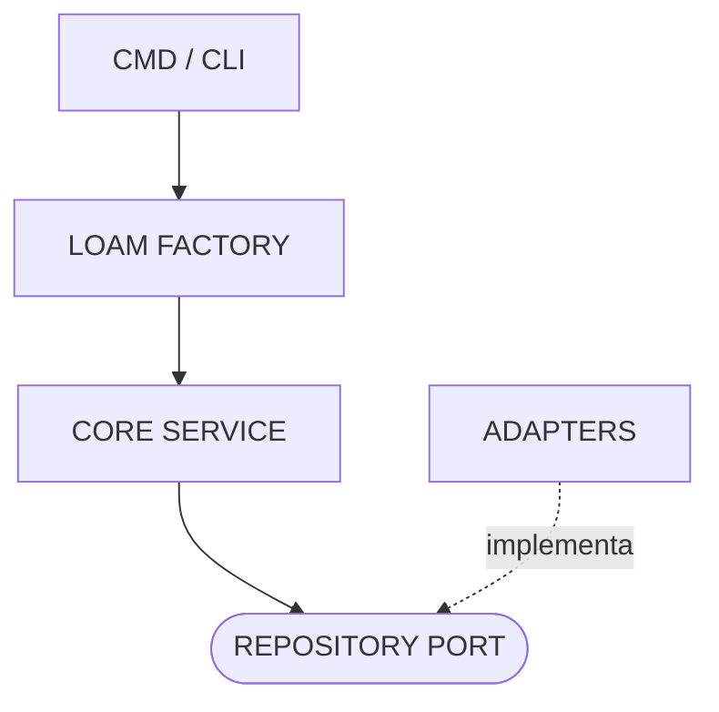

# Arquitetura Técnica

O **Loam** adota uma **Arquitetura Hexagonal (Ports & Adapters)** para garantir desacoplamento, testabilidade e extensibilidade. O núcleo do sistema opera independentemente do mecanismo de persistência, permitindo trocar o sistema de arquivos (FS + Git) por outras implementações (SQL, API, etc.) sem alterar as regras de negócio.

## Visão Geral

## Fluxos de Execução

### Batch Transaction (Atomicidade)

O fluxo de uma transação em lote garante que arquivos só sejam persistidos e commitados se todas as operações tiverem sucesso.

## Componentes

### 1. Core Domain (`pkg/core`)

- **Entidades**: `Document` (ID, Content, Metadata).
- **Ports (Interfaces)**: `Repository` (Save, Get, List, Delete) — O "Abstract Librarian".
- **Services**: `Service` (Orquestra validações e chama o Repository).
- **Dependências**: Zero dependências de infraestrutura.

### 2. Adapters (`pkg/adapters`)

Implementações concretas dos Ports definidos no Core.

- **FS Adapter (`pkg/adapters/fs`)**: Implementa `core.Repository`. A "Estante Física".
  - Gerencia a **persistência física** de Documentos (serializando como Markdown/YAML/JSON).
  - Utiliza `pkg/git` para controle de versão.
  - Mantém um **Cache (.loam/index.json)** para listagens rápidas (Otimização).

### 3. Internal Platform (`internal/platform`)

O "chão de fábrica" do sistema. Contém a implementação concreta do bootstrap e segurança.

- **Responsabilidade**: Factory method, Configuração de Opções, Sanitização de Paths (`ResolveVaultPath`) e utilitários de Dev (`IsDevRun`).
- **Visibilidade**: Privado para a biblioteca, não importável externamente.

### 4. Public Facade (`github.com/aretw0/loam`)

A fachada pública que simplifica o uso da biblioteca.

- **`loam.go`**: Expõe aliases para as funções do `internal/platform` (`New`, `Init`, `Sync`, `Option`).
- **Objetivo**: Manter a raiz do projeto limpa e fornecer uma API estável enquanto a implementação evolui internamente.

## Decisões Arquiteturais Chave

### 1. Storage Engine: Filesystem + Git (Driver Padrão)

- **Formato:** Arquivos de texto (`.md`, `.json`, `.yaml`, `.csv`) gerenciados pelo FS Adapter.
- **Transações:** O Git atua como *Write-Ahead Log*.
- **Semântica de Commit:** O adapter `fs` lê `commit_message` do `context.Context` durante operações de escrita.

### 2. Cache de Metadados

- **Problema:** Listar milhares de arquivos lendo do disco é lento.
- **Solução:** Index Persistente (`.loam/index.json`) mantido pelo Adapter FS. O diretório (`.loam`) é configurável via `WithSystemDir`.
- **Invalidação:** Baseada em timestamp (`mtime`).
- **Performance:** Reduz tempo de listagem de segundos para milissegundos (ex: 6s -> 13ms para 1k documentos).

### 3. Segurança (Dev Safety)

- **Isolamento**: Em modo de desenvolvimento (`go run`, `go test`), o Loam redireciona automaticamente operações para um diretório temporário (`%TEMP%/loam-dev/`) para evitar sujar o repositório do usuário.
- **ForceTemp**: Configurável via `loam.Config`.

## Estratégia de Testes

### 1. Unitários (`pkg/core`)

Testam regras de negócio usando Mocks em memória. Execução instantânea.

### 2. Integração (Integration Tests)

Testam o fluxo completo (Service + FS Adapter + Git) em diretórios temporários reais. Garantem que o contrato de persistência é cumprido.

### 3. Benchmarks (`examples/benchmarks`)

Medem a performance do Adapter e eficácia do Cache.
